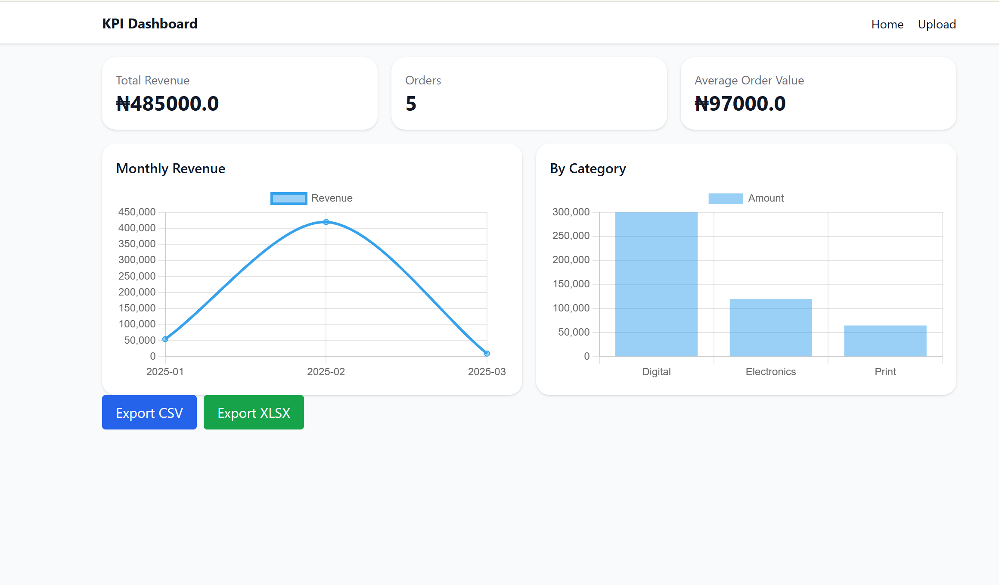
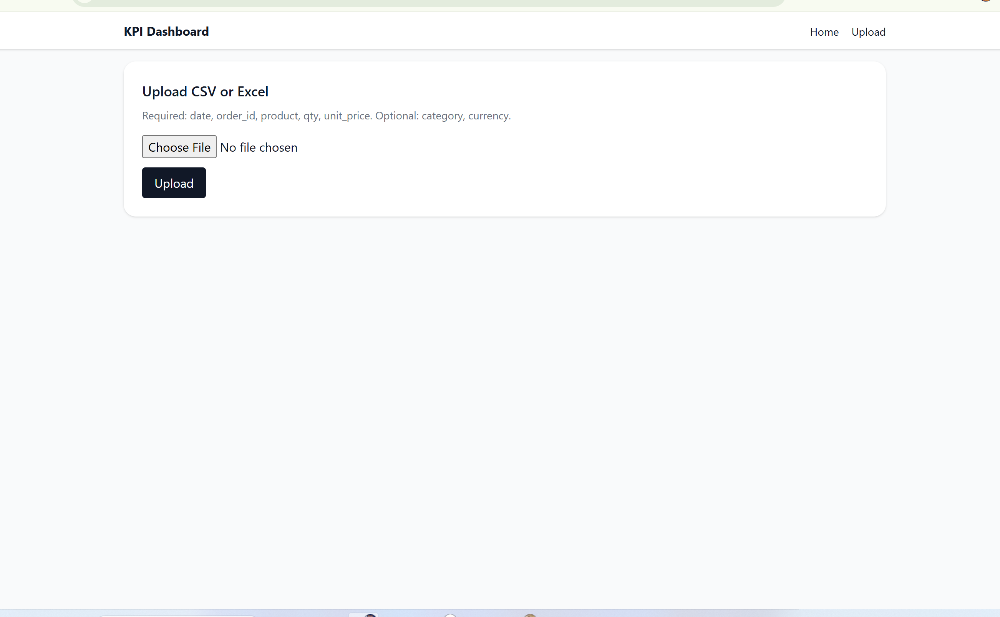

# KPI Dashboard

Custom Django KPI Dashboard that allows you to:

- Upload CSV/XLSX files of transactions or data.
- Instantly generate KPIs and charts.
- Export data back to CSV or Excel for reporting.

---

## Demo Video
Watch it in action: [Demo Link](YOUR_LOOM_OR_YOUTUBE_LINK_HERE)

---

## Screenshots



---

## Features
- CSV/XLSX upload with automatic parsing
- Interactive charts using Chart.js
- Export data in CSV or Excel
- Fully responsive Tailwind CSS design
- Ready for Upwork Portfolio & client demos

---

## Local Setup

1. Clone the repo:

```bash
git clone https://github.com/USERNAME/kpi-dashboard.git
cd kpi-dashboard
Create and activate virtual environment:

Windows:

bash
Copy
Edit
python -m venv venv
venv\Scripts\activate
macOS/Linux:

bash
Copy
Edit
python3 -m venv venv
source venv/bin/activate
Install dependencies:

bash
Copy
Edit
pip install -r requirements.txt
Apply migrations:

bash
Copy
Edit
python manage.py migrate
Create superuser (optional for admin):

bash
Copy
Edit
python manage.py createsuperuser
Run the server:

bash
Copy
Edit
python manage.py runserver
Open http://127.0.0.1:8000 in your browser.


---

## **Step 5: Add screenshots**

1. In your project folder, create a folder called `screenshots/`.
2. Save your dashboard demo images there (e.g., `dashboard.png`, `upload.png`).
3. The README links them correctly so anyone viewing the repo sees them.

---

## **Step 6: Add Demo Video**

1. Record a 60–90s video of your dashboard in action (Loom or OBS).  
2. Upload to **YouTube** (unlisted) or Loom.  
3. Copy the shareable link and replace `YOUR_LOOM_OR_YOUTUBE_LINK_HERE` in the README.

---

## **Step 7: Push README & Screenshots to GitHub**

```bash
git add README.md screenshots/
git commit -m "Add README and screenshots"
git push
